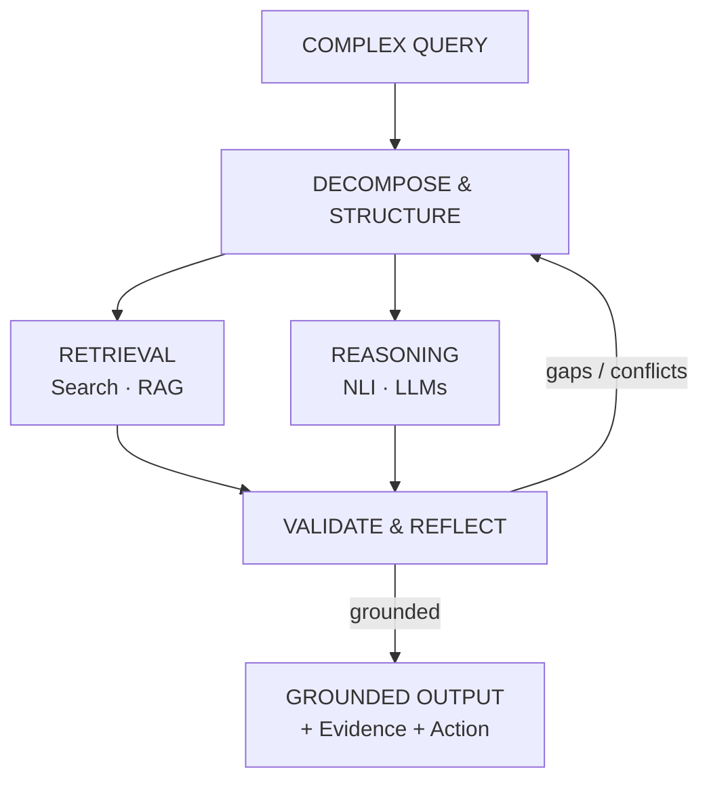

<div align="center">

# ⚡ ADETYA JAMWAL

**`AI ENGINEER`** // **`INTELLIGENT SYSTEMS`**

GenAI · Agentic Systems · Advanced RAG · ML Engineering

*Building systems that retrieve, reason, and act — with engineering boundaries that make AI more reliable.*

</div>

---

## 🌐 THE SYSTEMS I BUILD



---

## ⚡ WHAT I BUILD

### 🔎 Retrieval & Evidence
- **Claim decomposition** — breaking complex propositions into verifiable units
- **Hybrid retrieval** — multi-provider search and content extraction
- **Neural reranking** — passage-level cross-encoder scoring
- **NLI verification** — stance and contradiction detection

### 🧠 Agentic Systems
- **Stateful workflows** — graph-based execution with LangGraph
- **Query decomposition** — breaking complex research into parallel paths
- **Reflection loops** — identifying evidence gaps and iterating
- **Structured execution** — typed schemas and controlled tool flows

### 📈 ML Systems
- **Feature engineering** — high-dimensional time-series representations
- **Anomaly detection** — Autoencoders, Isolation Forest, One-Class SVM
- **Sequence modeling** — PyTorch LSTM for RUL prediction
- **Decision systems** — reinforcement-learning-based intervention policies

### ⚙️ AI Infrastructure
- **Async APIs** — FastAPI services and streaming endpoints
- **Data systems** — PostgreSQL, pgvector, Alembic
- **Caching** — Redis-based multi-tier caching
- **Engineering discipline** — Docker, testing, evaluation and security controls

---

## 🧬 FEATURED SYSTEMS

### `01` — TATHVYN
**Evidence Intelligence & Claim Verification Engine**

An evidence-driven claim verification system combining atomic decomposition, multi-source retrieval, neural reranking, NLI-based stance detection, and grounded verdict generation.

```text
CLAIM
  │
  ▼
DECOMPOSE ──────────────► Atomic sub-claims
  │
  ▼
RETRIEVE ───────────────► Tavily + Brave
  │
  ▼
RERANK ─────────────────► Cross-Encoder
  │
  ▼
VERIFY ─────────────────► DeBERTa / DistilRoBERTa NLI
  │
  ▼
VALIDATE ───────────────► Temporal + Numeric + Conflict Checks
  │
  ├──── gaps ───────────► Reflection / Retrieval
  │
  ▼
VERDICT ────────────────► Evidence + Grounded Synthesis
```

| | |
|---|---|
| **Engineering** | `FastAPI` · `LangGraph` · `PostgreSQL` · `pgvector` · `Redis` · `Docker` |
| **Quality** | 143+ tests · ~90% coverage · evaluation harness |
| **Security** | prompt isolation · input sanitization · SSRF defenses |

*Tathvyn represents the architectural evolution of an earlier claim-verification prototype, [VeriFact](https://github.com/AdetyaJamwal04/VeriFact---Retrieval-Augmented-Neural-Claim-Verification-System).*

**→ [Explore Tathvyn](https://github.com/AdetyaJamwal04/Tathvyn-Evidence-Intelligence-Claim-Verification-Engine)**

<br>

### `02` — DEEPSEARCH
**Agentic Research & Evidence Synthesis System**

A stateful research pipeline that decomposes complex questions, gathers evidence, identifies knowledge gaps, and iteratively refines its search through reflection.

```text
USER QUERY
    │
    ├──► QUERY SYNTHESIS
    │
    ├──► SUB-QUESTION GENERATION
    │
    ├──► SEARCH & RETRIEVAL
    │
    ├──► EVIDENCE EXTRACTION
    │
    ├──► KNOWLEDGE STORE
    │
    └──► REFLECTION
             │
        gaps detected?
             │
             └──────────► iterate
                           │
                           ▼
                    REPORT SYNTHESIS
```

| | |
|---|---|
| **Engineering** | `LangGraph` · `LangChain` · `Gemini` · `Tavily` · `FastAPI` · `Streamlit` |
| **Architecture** | stateful graph · cyclic reflection · structured schemas · streaming API |

**→ [Explore DeepSearch](https://github.com/AdetyaJamwal04/DeepSearch-Agentic-System)**

<br>

### `03` — C-MAPSS
**Spacecraft Predictive Maintenance System**

End-to-end ML pipeline for anomaly detection, remaining-useful-life prediction, and decision support using NASA C-MAPSS turbofan telemetry.

```text
NASA TELEMETRY
      │
      ▼
FEATURE ENGINEERING
17 sensors ──────────► 188 engineered features
      │
      ▼
ANOMALY DETECTION
Autoencoder · Isolation Forest · One-Class SVM
      │
      ▼
RUL PREDICTION
PyTorch LSTM
      │
      ▼
RISK / DECISION ENGINE
      │
      ▼
Q-LEARNING
Intervention timing
```

| | |
|---|---|
| **Engineering** | `PyTorch` · `scikit-learn` · `LSTM` · `Autoencoders` · `Q-Learning` · `Streamlit` |
| **Verified result** | `15.17 RMSE · R² = 0.87` on FD001 |

**→ [Explore C-MAPSS](https://github.com/AdetyaJamwal04/C-MAPSS-Spacecraft-Predictive-Maintenance-System)**

---

## 📊 ENGINEERING SIGNALS

| Metric | Value | Project |
|---|---|---|
| Tests | **143+** | Tathvyn |
| Coverage | **~90%** | Tathvyn |
| Engineered Features | **188** | C-MAPSS |
| Architecture Docs | **26** | Tathvyn |

---

## 🛠️ TECHNICAL ARSENAL

| Capability | Stack |
|---|---|
| **GenAI & Agents** | `LangGraph` · `LangChain` · `Google Gemini` · `Groq` |
| **Retrieval & NLP** | `Cross-Encoders` · `DeBERTa NLI` · `Sentence Transformers` · `Tavily` · `Brave` |
| **ML / Deep Learning** | `PyTorch` · `scikit-learn` · `TensorFlow` · `LSTM` · `Autoencoders` · `NumPy` · `Pandas` |
| **Backend & Data** | `FastAPI` · `Pydantic` · `PostgreSQL` · `pgvector` · `Redis` · `SQLAlchemy` · `Alembic` |
| **Infrastructure & Quality** | `Docker` · `Docker Compose` · `pytest` · `ruff` · `mypy` · `uv` · `Render` |

---

## 💡 HOW I THINK

```text
┌──────────────────────────────────────────────────────────────────────┐
│                                                                      │
│  01 / MODELS ARE COMPONENTS, NOT SYSTEMS.                            │
│      Reliability emerges from orchestration, boundaries,             │
│      validation, and failure handling.                               │
│                                                                      │
│  02 / RETRIEVAL IS PART OF REASONING.                                │
│      An intelligent system is only as grounded as the                │
│      information it can discover, filter, and verify.                │
│                                                                      │
│  03 / SYSTEMS REQUIRE EVALUATION, NOT VIBES.                         │
│      Fluency is not correctness. AI systems need measurable          │
│      behavior, regression testing, and adversarial evaluation.       │
│                                                                      │
│  04 / GROUNDING PRECEDES GENERATION.                                 │
│      Useful intelligence needs traceable evidence and                │
│      explicit boundaries around uncertainty.                         │
│                                                                      │
└──────────────────────────────────────────────────────────────────────┘
```

---

## 🧭 EXPLORING NEXT

```text
◉ Agentic Tool Use & Multi-Agent Systems
◉ LLM Evaluation & Regression Testing
◉ Advanced RAG & Knowledge Graph Retrieval
◉ Production MLOps & AI Observability
◉ Reliable AI System Architecture
```

---

<div align="center">

**`BUILD → MEASURE → VERIFY → ITERATE`**

*We build machines to reason — while remaining fascinated by the questions,
poetry, and philosophy that resist computation.*

</div>