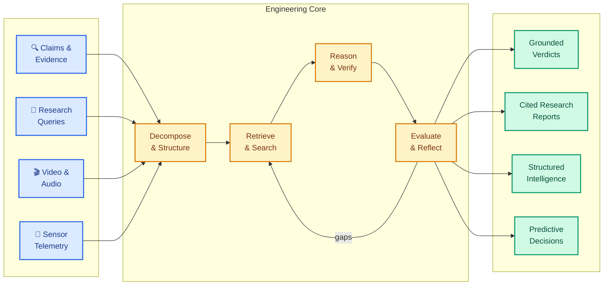

<div align="center">

# Adetya Jamwal

**AI Engineer** — Retrieval-Augmented Systems · Agentic Architectures · Applied ML

*Building systems that retrieve, reason, and act — with engineering discipline that makes AI reliable.*

<br/>

[](https://github.com/AdetyaJamwal04)
[](https://python.org)
[](https://fastapi.tiangolo.com)
[](https://pytorch.org)
[](https://nextjs.org)
[](https://cloud.google.com)

</div>

---



---

## What I Build

<table>
<tr>
<td width="50%" valign="top">

### Retrieval & Verification

Claim decomposition into atomic propositions · multi-provider evidence retrieval · cross-encoder neural reranking · NLI-based stance detection · provenance conflict resolution · calibrated verdict synthesis

</td>
<td width="50%" valign="top">

### Agentic Systems

LangGraph state machines · query decomposition into parallel research paths · iterative reflection loops with gap detection · structured schemas and controlled tool execution · streaming APIs

</td>
</tr>
<tr>
<td width="50%" valign="top">

### Multimodal Intelligence

Video/audio transcription with Faster-Whisper · conversational RAG over media content · structured executive summaries · real-time SSE streaming · multi-language document generation

</td>
<td width="50%" valign="top">

### ML Systems & Infrastructure

Time-series feature engineering · anomaly detection (Autoencoders, Isolation Forest) · LSTM sequence modeling · reinforcement learning decision engines · FastAPI services · Docker · Google Cloud Run

</td>
</tr>
</table>

---

## Featured Systems

### `01` — [Tathvyn-Evidence-Intelligence-Claim-Verification-Engine](https://github.com/AdetyaJamwal04/Tathvyn-Evidence-Intelligence-Claim-Verification-Engine)

**Evidence Intelligence & Claim Verification Engine**

Full-stack, production-deployed platform for automated claim verification. Decomposes natural language claims into atomic propositions, retrieves multi-source web evidence, validates with cross-encoder reranking and DeBERTa NLI, resolves conflicts through provenance clustering, and synthesizes calibrated epistemic verdicts with Brier scoring.

```
CLAIM → DECOMPOSE → RETRIEVE (Tavily + Brave) → RERANK (MS-MARCO Cross-Encoder)
  → VERIFY (DeBERTa NLI) → VALIDATE (Temporal + Numeric + Conflict)
  → REFLECT (gap detection) → VERDICT (Brier-calibrated + Cited)
```

| | |
|---|---|
| **Backend** | `FastAPI` · `LangGraph` · `DeBERTa NLI` · `MS-MARCO CrossEncoder` · `Redis` · `Gemini 2.0 Flash` |
| **Frontend** | `React 18` · `Vite` · `SSE Streaming` |
| **Deployment** | `Google Cloud Run` (2 vCPU, 4 GiB) · `Firebase Hosting` (Global CDN) · `Google Secret Manager` |
| **Quality** | 143 tests · ~90% coverage · 50-claim evaluation benchmark · 27 architecture docs |
| **Security** | Prompt isolation · input sanitization · SSRF defense · rate limiting |

*Architectural evolution of [VeriFact](https://github.com/AdetyaJamwal04/VeriFact---Retrieval-Augmented-Neural-Claim-Verification-System), an earlier local-inference prototype.*

---

### `02` — [Anveshaka-The-One-Who-Investigates.](https://github.com/AdetyaJamwal04/DeepSearch-Agentic-System)

**Agentic Research & Evidence Synthesis**

Autonomous research agent that decomposes complex queries, runs multi-round web searches, extracts and deduplicates evidence, reflects on coverage gaps, and iteratively synthesizes cited markdown reports. Built as a LangGraph state machine with up to 3 research rounds.

```
QUERY → SYNTHESIS → SUB-QUESTION GENERATION → SEARCH & RETRIEVAL
  → EVIDENCE EXTRACTION → KNOWLEDGE STORE → REFLECTION
  → [gaps?] → iterate / REPORT SYNTHESIS (inline citations)
```

| | |
|---|---|
| **Stack** | `LangGraph` · `Gemini` · `Tavily` · `FastAPI` · `Streamlit` |
| **Architecture** | Stateful graph · cyclic reflection · structured schemas · streaming API |

---

### `03` — [Bodha — Understand Anything You Watch](https://github.com/AdetyaJamwal04/AI-Video-Assistant)

**Multimodal Video Intelligence Platform**

Full-stack platform that transforms video/audio content into structured intelligence. Faster-Whisper transcription with int8 quantization, session-isolated conversational RAG over ChromaDB with exact timestamp citations, structured executive summaries via Mistral AI, multi-language translation, and publication-ready PDF/Markdown export.

```
VIDEO/AUDIO → FASTER-WHISPER (CTranslate2, int8) → TRANSCRIPT
  → STRUCTURED INTELLIGENCE (Mistral + Pydantic schemas)
  → CONVERSATIONAL RAG (ChromaDB, session-isolated, [MM:SS] citations)
  → MULTI-LANGUAGE TRANSLATION → PDF/MD EXPORT
```

| | |
|---|---|
| **Backend** | `FastAPI` · `Faster-Whisper` · `ChromaDB` · `Mistral AI` · `SSE Streaming` |
| **Frontend** | `Next.js 15` · `TypeScript` · `Tailwind CSS` |
| **Infrastructure** | `Docker` · `docker-compose` · `GitHub Actions CI` · `pre-commit` hooks |
| **Security** | SSRF defense · URL validation · file-type verification · 5 GB disk quota with TTL |

---

### `04` — [C-MAPSS Predictive Maintenance](https://github.com/AdetyaJamwal04/C-MAPSS-Spacecraft-Predictive-Maintenance-System)

**Spacecraft Engine Intelligence**

End-to-end predictive maintenance pipeline on NASA C-MAPSS turbofan telemetry. Anomaly detection (Isolation Forest, One-Class SVM, Deep Autoencoder), LSTM-based remaining useful life prediction, a rule-based + AI risk-scoring decision engine, and a Q-learning RL agent for optimal intervention timing.

```
TELEMETRY (17 sensors) → FEATURE ENGINEERING (188 features)
  → ANOMALY DETECTION (Autoencoder · IF · OC-SVM)
  → RUL PREDICTION (LSTM) → DECISION ENGINE → Q-LEARNING
```

| | |
|---|---|
| **Stack** | `PyTorch` · `scikit-learn` · `LSTM` · `Q-Learning` · `Streamlit` |
| **Results** | 0.951 ROC-AUC (anomaly) · 15.17 RMSE, R²=0.87 (RUL) · 7-page dashboard |

---

## Technical Stack

| Domain | Technologies |
|---|---|
| **GenAI & Agents** | LangGraph · LangChain · Google Gemini · Mistral AI · Groq |
| **Retrieval & NLP** | Cross-Encoders · DeBERTa NLI · Sentence Transformers · ChromaDB · Tavily · Brave |
| **ML / Deep Learning** | PyTorch · scikit-learn · TensorFlow · Faster-Whisper · LSTM · Autoencoders · DDPM |
| **Backend** | FastAPI · Pydantic · Redis · SQLAlchemy · Alembic · SSE Streaming |
| **Frontend** | React 18 · Vite · Next.js 15 · TypeScript · Tailwind CSS · Streamlit |
| **Cloud & Infrastructure** | Google Cloud Run · Firebase Hosting · Docker · Docker Compose · GitHub Actions · pre-commit · pytest · ruff · uv |

---

## How I Think

```
  MODELS ARE COMPONENTS, NOT SYSTEMS.
  Reliability comes from orchestration, validation, and failure handling.

  RETRIEVAL IS PART OF REASONING.
  Intelligence is only as grounded as the evidence it can discover and verify.

  EVALUATION, NOT VIBES.
  Fluency is not correctness. AI systems need measurable behavior.

  GROUNDING PRECEDES GENERATION.
  Useful intelligence needs traceable evidence and explicit uncertainty boundaries.
```

---

## Currently Exploring

```
  ◉ Multi-Agent Tool Use & Coordination
  ◉ LLM Evaluation & Regression Testing
  ◉ Advanced RAG & Knowledge Graph Retrieval
  ◉ AI Observability & Production MLOps
```

---

<div align="center">

`BUILD · MEASURE · VERIFY · ITERATE`

*We build machines to reason — while staying curious about the questions, poetry, and philosophy that resist computation.*

<br/>

[](https://github.com/AdetyaJamwal04)

<!-- LinkedIn -->

<!-- Email -->

</div>
